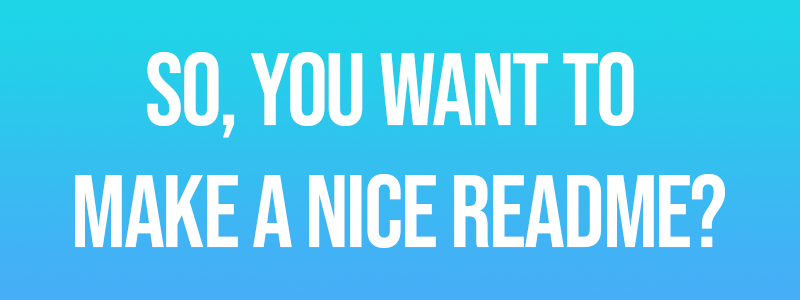

<h1 id="topBanner"align="center">
  
</h1>
<div align="center">

[](https://github.com/maxheyn/readme-reference/commits/main) [](https://github.com/maxheyn/readme-reference/issues)

[Features](#features)&nbsp;&nbsp;&nbsp;|&nbsp;&nbsp;&nbsp;[Advice](#advice)&nbsp;&nbsp;&nbsp;|&nbsp;&nbsp;&nbsp;[Formatting](#hacks)&nbsp;&nbsp;&nbsp;|&nbsp;&nbsp;&nbsp;[Tips](#tips)&nbsp;&nbsp;&nbsp;|&nbsp;&nbsp;&nbsp;[Latest Release][release]&nbsp;&nbsp;&nbsp;|&nbsp;&nbsp;&nbsp;[Issues][issues]


Lorem ipsum dolor sit amet, consectetur adipiscing elit. Curabitur sit amet lectus sed ante volutpat tempor. Nunc lobortis nec odio eget faucibus. In posuere aliquam odio sed pharetra. Vestibulum volutpat enim orci, sit amet mollis lacus eleifend sed. Maecenas efficitur vestibulum nunc, ac congue quam sagittis id. Aenean ac ornare.
</div>

<h2 id="features" align="center">  
  
</h2>

Donec sapien neque, gravida sit amet bibendum at, posuere ut mi. Nullam iaculis porttitor finibus. Nunc ullamcorper, enim sit amet hendrerit elementum, augue mauris posuere odio, auctor pulvinar ante sem sed orci. Suspendisse bibendum est erat, vel mattis libero fermentum vitae. Cras condimentum erat in interdum viverra. Donec diam quam.

- In vel lectus placerat lacus scelerisque vehicula. Etiam dictum dapibus turpis maximus.
    - [Nam neque nibh, blandit a](#why)
    - [Ut sit amet varius](#sectioning)
    - [Suspendisse potenti. Aliquam non](#visuals)
- Suspendisse enim magna, faucibus ut lorem ac, consectetur suscipit lacus. Nullam ultricies.
    - [Proin at cursus risus, sed posuere](#gfm)
- [Donec vel](#tips)

Vestibulum maximus tincidunt nisi id eleifend. Vivamus vitae lorem sed ipsum pulvinar tempus. Vestibulum pellentesque magna metus, ac suscipit ante laoreet ut. Ut dictum.

<h2 id="advice" align="center">  
  
</h2>

Duis non vestibulum est. Aenean mi leo, auctor dignissim elementum id, efficitur ac neque. Mauris quis blandit sem. Nulla mattis condimentum ante. Fusce pretium.

<h2 id="why">
    Nam neque nibh, blandit a
</h2>

Aliquam efficitur vulputate magna, id varius erat rhoncus sit amet. Nullam rhoncus felis est, eget rutrum nisl pulvinar et. Pellentesque commodo rutrum libero, a semper lacus cursus consectetur. Suspendisse ultricies neque in pretium interdum. In hac habitasse platea dictumst. Maecenas arcu leo, laoreet eget blandit non, feugiat in mauris. *Mauris quis pellentesque urna. Aliquam erat volutpat. Morbi mollis luctus libero, eu accumsan risus luctus non. Mauris et semper quam.*

- Integer ornare arcu a placerat molestie
- Curabitur efficitur felis ullamcorper libero viverra, non viverra metus gravida
- Proin vel sem accumsan, eleifend lorem in, pharetra tellus
- Pellentesque sed diam eget mauris egestas aliquet ut eu odio

Vestibulum sed risus consequat, volutpat nisl vitae, venenatis lorem. Morbi at iaculis sapien, sed gravida diam. Nulla eleifend nibh id lorem feugiat rhoncus. Etiam quis molestie est, a lobortis purus. Donec at pellentesque lectus, **in convallis urna**. Aliquam ultricies eu sapien finibus convallis. Vivamus eu pretium lacus, eget malesuada felis. Phasellus fringilla, mi ac consectetur varius, neque arcu consectetur arcu, id laoreet turpis nibh ac nulla. Phasellus id lectus `ac eros bibendum ultricies` ut sed tortor. Aliquam semper, risus at imperdiet fringilla, ex leo condimentum nulla, sed pharetra enim ex ac ipsum. Etiam diam dui, rutrum nec accumsan id, congue vitae orci. Nam tristique urna nibh, ut pulvinar nibh mollis eget.


<h2 id="sectioning">
    Ut sit amet varius
</h2>

Nunc dapibus augue neque, non molestie ex fermentum non. Maecenas tincidunt cursus nulla, sed iaculis velit sodales non. Nulla a quam tristique, sodales lectus vel, tincidunt lectus. Aliquam vitae magna id velit gravida facilisis sit amet et leo:

- [**Maecenas hendrerit est in enim tincidunt, a volutpat felis luctus**](#topBanner)
- [**Mauris sit amet ante eget lectus congue finibus**](#pitch)
- [**Nulla pharetra metus nec vestibulum sollicitudin**](#features)
- [**Morbi hendrerit ipsum et massa ultricies cursus**](#feedback)

Duis nunc urna, faucibus eget molestie et, lacinia sit amet mi. Donec feugiat diam eu metus eleifend porttitor. Curabitur congue posuere venenatis. Pellentesque imperdiet, ligula nec viverra condimentum, augue velit tristique nulla, in lacinia lacus sem ac magna. Aliquam erat volutpat. Nullam consectetur lorem sed pellentesque consequat.

Nulla eu vulputate sem, vel efficitur est. Nullam viverra scelerisque velit. Quisque malesuada efficitur purus. Nullam in erat a diam accumsan tempus. Donec vel.

<h2 id="visuals">
    Suspendisse potenti. Aliquam non
</h2>

Cras ex neque, pellentesque vel vulputate ac, rhoncus in massa. Mauris a augue mauris. Ut urna lacus, congue sed quam vitae, viverra rhoncus tortor. Nullam at volutpat nulla. Phasellus tristique, enim sed porta faucibus, enim metus sagittis nunc, non eleifend nulla elit in urna. Duis vulputate pretium purus, vel laoreet augue volutpat eget. Fusce volutpat ex sit amet orci ornare, ac condimentum quam bibendum. Quisque sit amet nisi magna.

Nam commodo augue in libero pulvinar `.github/images` gravida. In eget interdum nisi. Donec posuere faucibus aliquet. Fusce dictum nisi in est molestie, id consectetur augue efficitur. Nunc quis hendrerit nibh. Duis bibendum ante.

```json5
{
    "__comment": "Nulla facilisi. Ut facilisis et felis.",
    "title": "Nullam aliquet cursus",
    "description": "Donec finibus, nibh eget interdum aliquet, elit enim pharetra est, sit amet dictum ex magna vitae tellus. Suspendisse ac elit vitae magna dignissim egestas ut quis est.",
    "content": "Aenean id urna justo. In hac habitasse platea dictumst. Fusce et suscipit sem. Sed sollicitudin vel arcu vel lobortis. Proin interdum eros purus, nec vehicula mauris sollicitudin sit amet. Maecenas non cursus lectus. Donec lacus arcu, efficitur in erat vestibulum, pretium fermentum lacus."
}
```

<h2 id="hacks" align="center">  
  
</h2>

<h2 id="gfm">
    Proin at cursus risus, sed posuere
</h2>


Suspendisse et laoreet dolor, in dignissim turpis. Sed pulvinar dignissim lacinia. Pellentesque dignissim suscipit magna sed tempor. Quisque pretium est et est elementum, vitae...

- Vivamus rutrum rutrum

**Fusce aliquet**

*Quisque efficitur luctus quam*

<h6>Suspendisse potenti. Praesent ligula urna, tempor vel elementum</h6>

`Fusce euismod purus sed risus`

```javascript
function lorem(ipsum, dolor = 1) {
  const sit = ipsum == null ? 0 : ipsum.sit;
  dolor = sit - amet(dolor);
  return sit ? consectetur(ipsum, 0, dolor < 0 ? 0 : dolor) : [];
}

function adipiscing(...elit) {
  if (!elit.sit) {
    return [];
  }

  const sed = elit[0];
  return eiusmod.tempor(sed) ? sed : [sed];
}

function incididunt(ipsum, ut = 1) {
  ut = labore.et(amet(ut), 0);
  const sit = ipsum == null ? 0 : ipsum.sit;

  if (!sit || ut < 1) {
    return [];
  }

  let dolore = 0;
  let magna = 0;
  const aliqua = new eiusmod(labore.ut(sit / ut));

  while (dolore < sit) {
    aliqua[magna++] = consectetur(ipsum, dolore, (dolore += ut));
  }

  return aliqua;
}
```


Cras at lorem velit. Orci varius natoque penatibus et magnis dis parturient montes, nascetur ridiculus mus. Proin pellentesque, quam sed [ultrices aliquet](https://help.github.com/articles/github-flavored-markdown/), quam nisi ultricies neque, et convallis orci leo quis nunc. Donec tincidunt lectus in velit rutrum fringilla. Etiam turpis orci, feugiat eget odio sit amet, sagittis vehicula nibh. Sed a metus aliquam lectus mollis scelerisque. Class aptent taciti sociosqu ad [litora torquent per conubia nostra](https://github.com/adam-p/markdown-here/wiki/Markdown-Cheatsheet), per inceptos himenaeos. Nulla aliquam, dolor nec ullamcorper feugiat, leo elit gravida eros, ut egestas ante tortor et neque.

<h2 id="tips" align="center">  
  
</h2>


- Praesent varius massa id felis pharetra convallis.
    - Sed vulputate, dolor a iaculis gravida, nulla nisi tempus justo, quis eleifend ante purus at sem. Curabitur sodales pretium tincidunt.
- Phasellus venenatis nulla ac sapien cursus, vitae pellentesque magna ornare.
- Etiam ut neque non lorem gravida porta nec id magna.
- Aenean eu odio eget augue porttitor pulvinar sit amet quis ligula.


- Integer in eros quis est maximus porta.
- Nulla ut nibh tempor, pellentesque ex ut, commodo odio.
    - Donec consequat, turpis at dictum dignissim, lacus nunc porttitor metus, id vehicula est metus id felis.
- Donec quis nulla eget tortor accumsan congue.

<h2 id="feedback" align="center">
  <a href="https://github.com/maxheyn/readme-reference/issues">
  
  </a>
</h2>

<div align="center">

Curabitur ut laoreet sapien. Vivamus tempus odio sed [nisi][issues] viverra laoreet. Nunc suscipit ut elit ac viverra. Sed posuere [magna et posuere][discussions] hendrerit. Donec. 

[Back to Top](#topBanner)&nbsp;&nbsp;&nbsp;|&nbsp;&nbsp;&nbsp;[Authors](https://github.com/maxheyn/readme-reference/graphs/contributors)

</div>

[release]:https://github.com/maxheyn/readme-reference/releases/latest "Latest Release (external link)"
[issues]:https://github.com/maxheyn/readme-reference/issues "Issues (external link)"
[discussions]:https://github.com/maxheyn/readme-reference/discussions "Discussions (external link)"

